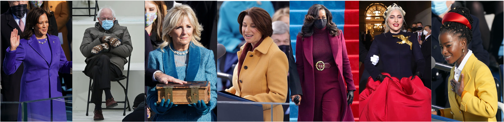

<!-- README.md is generated from README.Rmd. Please edit that file -->

```{r setup, include = FALSE}
knitr::opts_chunk$set(
  collapse = TRUE,
  comment = "#>",
  fig.path = "man/figures/README-",
  out.width = "100%"
)
```

# Inauguration Palette 

An R palette insipred by the beautiful colors of the 2021 inauguration


## Installation

You can install the released version of inauguration from GitHub with

```{r eval = FALSE}
# install.packages("devtools")
devtools::install_github("ciannabp/inauguration")
```

## Usage

```{r}
library(inauguration)

names(inauguration_palettes)
```


You can call the palette in just one command

```{r results = 'show'}
inauguration("inauguration_2021")
```


If you want a specific number of colors, you can also do that.

```{r}
inauguration("inauguration_2021", 3)
```

...and for the Bernie fans out there



```{r results = 'show'}
inauguration("inauguration_2021_bernie")
```
 


```{r results = 'show'}
inauguration("bernie_mittens")
```
