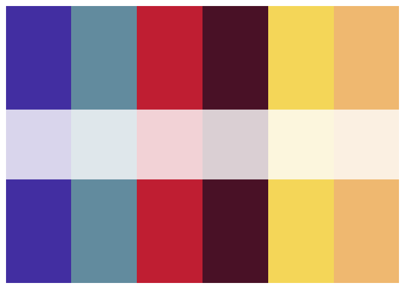
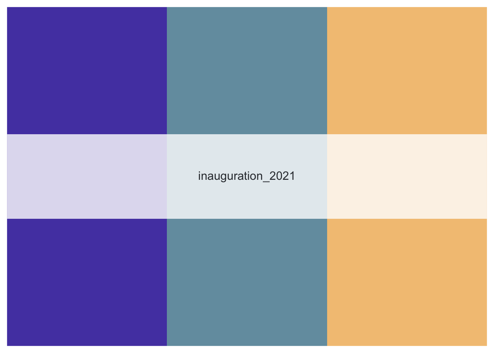
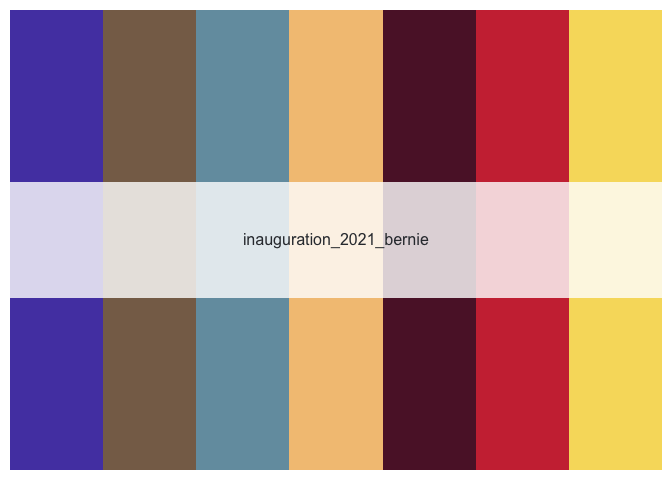

<!-- README.md is generated from README.Rmd. Please edit that file -->

# Inauguration Palette

An R palette insipred by the beautiful colors of the 2021 inauguration


## Installation

You can install the released version of inauguration from GitHub with

``` r
# install.packages("devtools")
devtools::install_github("ciannabp/inauguration")
```

## Usage

``` r
library(inauguration)

names(inauguration_palettes)
#> [1] "inauguration_2021"        "inauguration_2021_bernie"
```

You can call the palette in just one command

``` r
inauguration("inauguration_2021")
```




If you want a specific number of colors, you can also do that.

``` r
inauguration("inauguration_2021", 3)
```



…and for the Bernie fans out there


``` r
inauguration("inauguration_2021_bernie")
```


